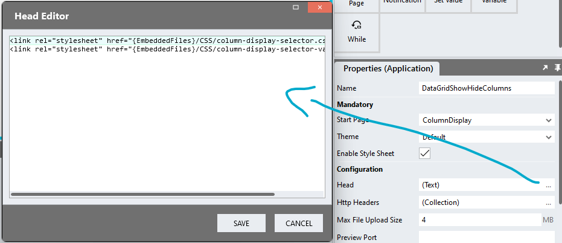

# DataGrid Show / Hide Columns

DataGrids sometimes contain a long list of fields and can get very wide. This repo contains a module that allows users to hide columns they don't want to see. Customisations to the column display are automatically saved per visitor and reapplied when the visitor returns. 

https://github.com/stadium-software/datagrid-showhide-columns/assets/2085324/bf547320-b77f-49bd-b03b-df9fa9ca2d6f

# Version 
1.0

## Application Setup
1. Check the *Enable Style Sheet* checkbox in the application properties

## Database, Connector and DataGrid
1. Use the instructions from [this repo](https://github.com/stadium-software/samples-database) to setup the database and DataGrid for this sample

## Global Script Setup
1. Create a Global Script called "ColumnDisplay"
2. Add two input parameters to the Global Script
   1. DataGridClass
   2. InitialHiddenColumns
3. Drag a *JavaScript* action into the script
4. Add the Javascript below into the JavaScript code property
```javascript
let colsParameter = ~.Parameters.Input.InitialHiddenColumns;
let dgParameter = ~.Parameters.Input.DataGridClass;
let dgClass = "." + dgParameter;
const pathname = window.location.pathname;
let cookieCols = getCookie(pathname + "-" + dgParameter + "-hidden-columns");
if (cookieCols !== null) {
    colsParameter = cookieCols.split(",");
}
const capitalize = (str) => `${str.charAt(0).toUpperCase()}${str.slice(1)}`;
let table = document.querySelector(dgClass + " table");
if (!table) table = document.querySelector(".data-grid-container");
let headingElements = table.querySelectorAll("thead th a");
let arrHeadings = formatHeadings(headingElements);
let displayHeadings = formatDisplayHeadings(headingElements);
let hideCols = [];
if (colsParameter) hideCols = (colsParameter = colsParameter.map((i) => i.toLowerCase().replaceAll(" ", "")));
let options = {
        childList: true,
        subtree: true,
    },
    observer = new MutationObserver(initDataGridHide);

observer.observe(table, options);
initDataGridHide();

function initDataGridHide() {
    if (table.querySelectorAll("tbody tr").length < 2) return false;
    observer.disconnect();
    showColumnSelector();
    for (let i = 0; i < hideCols.length; i++) {
        hideColumn(getColumnNumber(hideCols[i]));
    }
    document.querySelector(".column-display-selector-header").addEventListener("click", function(e){
        e.target.closest(".column-display-selector-container").classList.toggle("expand");
    });
    document.body.addEventListener("click", function(e){
        if (!e.target.closest(".column-display-selector-container")) {
            let allDD = document.querySelectorAll(".column-display-selector-container");
            for (let i=0;i<allDD.length;i++){
                allDD[i].classList.remove("expand");
            }
        }
    });
}

function hideColumn(no) {
    if (no == 0) return;
    let heading = arrHeadings[no - 1];
    document.getElementById(heading).checked = false;
    table.querySelector("th:nth-child(" + no + ")").classList.add("hidden-column");
    let cells = table.querySelectorAll("tbody tr td:nth-child(" + no + ")");
    for (let i = 0; i < cells.length; i++) {
        cells[i].classList.add("hidden-column");
    }
    createCookie(pathname + "-" + dgParameter + "-hidden-columns", getHiddenColsArray(), 30);
}
function showColumn(no) {
    if (no == 0) return;
    let heading = arrHeadings[no - 1];
    document.getElementById(heading).checked = true;
    table.querySelector("th:nth-child(" + no + ")").classList.remove("hidden-column");
    let cells = table.querySelectorAll("tbody tr td:nth-child(" + no + ")");
    for (let i = 0; i < cells.length; i++) {
        cells[i].classList.remove("hidden-column");
    }
    createCookie(pathname + "-" + dgParameter + "-hidden-columns", getHiddenColsArray(), 30);
}
function getColumnNumber(title) {
    return arrHeadings.indexOf(title) + 1;
}
function showColumnSelector() {
    let checkboxListContainer = document.createElement("div");
    checkboxListContainer.classList.add("column-display-selector-container");
    let dropDownHeader = document.createElement("div");
    dropDownHeader.classList.add("column-display-selector-header");
    let dropDownHeaderText = document.createElement("span");
    dropDownHeaderText.innerText = "Columns";
    dropDownHeader.appendChild(dropDownHeaderText);
    checkboxListContainer.appendChild(dropDownHeader);
    let checkboxList = document.createElement("div");
    checkboxList.classList.add("control-container", "check-box-list-container", "column-display-checkboxlist");
    checkboxListContainer.appendChild(checkboxList);
    for (let i = 0; i < headingElements.length; i++) {
        let labelText = displayHeadings[i];
        let checkboxID = arrHeadings[i];
        let checkboxContainer = document.createElement("div");
        checkboxContainer.classList.add("checkbox");
        let checkbox = document.createElement("input");
        checkbox.setAttribute("type", "checkbox");
        checkbox.checked = true;
        checkbox.setAttribute("value", labelText);
        checkbox.setAttribute("id", checkboxID);
        checkbox.addEventListener("change", toggleColumnDisplay);
        let checkboxLabel = document.createElement("label");
        checkboxLabel.setAttribute("for", checkboxID);
        checkboxLabel.innerText = labelText;
        checkboxContainer.appendChild(checkbox);
        checkboxContainer.appendChild(checkboxLabel);
        checkboxList.appendChild(checkboxContainer);
    }
    let dgHead = document.querySelector(".data-grid-header");
    dgHead.appendChild(checkboxListContainer);
}
function toggleColumnDisplay(e) {
    let el = e.target;
    if (el.checked) {
        showColumn(getColumnNumber(el.id));
    } else {
        hideColumn(getColumnNumber(el.id));
    }
}
function formatDisplayHeadings(arr) {
    let headings = [];
    for (let i = 0; i < arr.length; i++) {
        let arrHeading = arr[i].textContent.split(" ");
        let heading = "";
        let space = "";
        for (let j = 0; j < arrHeading.length; j++) {
            heading += space + capitalize(arrHeading[j]);
            space = " ";
        }
        headings.push(heading);
    }
    return headings;
}
function formatHeadings(arr) {
    let headings = [];
    for (let i = 0; i < arr.length; i++) {
        headings.push(arr[i].textContent.toLowerCase().replaceAll(" ", ""));
    }
    return headings;
}
function getHiddenColsArray() {
    let hiddenCols = [];
    for (let i = 0; i < headingElements.length; i++) {
        if (headingElements[i].closest("th").classList.contains("hidden-column")) {
            hiddenCols.push(headingElements[i].textContent);
        }
    }
    return hiddenCols;
}
function createCookie(name, value, days) {
    let expires = "";
    if (days) {
        let date = new Date();
        date.setTime(date.getTime() + days * 24 * 60 * 60 * 1000);
        expires = "; expires=" + date.toGMTString();
    }
    document.cookie = name + "=" + value + expires + "; path=/";
}

function getCookie(c_name) {
    if (document.cookie.length > 0) {
        let c_start = document.cookie.indexOf(c_name + "=");
        if (c_start != -1) {
            c_start = c_start + c_name.length + 1;
            let c_end = document.cookie.indexOf(";", c_start);
            if (c_end == -1) {
                c_end = document.cookie.length;
            }
            return document.cookie.substring(c_start, c_end);
        }
    }
    return null;
}
```

## Page Setup
1. Drag a *DataGrid* control to the page ([see above](#database-connector-and-datagrid))
2. Add a class of your choosing to the *DataGrid* *Classes* property that uniquely identifies this DataGrid on this page (e.g datagrid-hide-cols)
3. Note: If multiple editable DataGrids are shown on one page, each DataGrid must have a unique classname

## Page.Load Event Setup
1. Populate your DataGrid with data ([see above](#database-connector-and-datagrid))
2. To initialise the DataGrid with hidden columns
   1. Drag a *List* action into the script (type: Any)
   2. Enter the names of the columns you want to hide by default into the List Value property (see example below)
3. Drag the *ColumnDisplay* script into the script and complete the input parameters
   1. DataGridClass: The unique class you assigned to the *DataGrid* (e.g datagrid-hide-cols)
   2. InitialHiddenColumns: Leave blank or select your *List* containing the initial hidden columns from the dropdown

List Value Example:
```json
= ["FirstName","last name"]
```

# Styling
Various elements in this module can be styled using the two CSS files in this repo

## Applying the CSS

**Stadium 6.6 or higher**
1. Create a folder called "CSS" inside of your Embedded Files in your application
2. Drag the two CSS files from this repo [*column-display-selector-variables.css*](column-display-selector-variables.css) and [*column-display-selector.css*](column-display-selector.css) into that folder
3. Paste the link tags below into the *head* property of your application
```html
<link rel="stylesheet" href="{EmbeddedFiles}/CSS/column-display-selector.css">
<link rel="stylesheet" href="{EmbeddedFiles}/CSS/column-display-selector-variables.css">
``` 



**Versions lower than 6.6**
1. Copy the CSS from the two css files into the Stylesheet in your application

## Customising CSS
1. Open the CSS file called [*column-display-selector-variables.css*](column-display-selector-variables.css) from this repo
2. Adjust the variables in the *:root* element as you see fit
3. Overwrite the file in the CSS folder of your application with the customised file

## CSS Upgrading
To upgrade the CSS in this module, follow the [steps outlined in this repo](https://github.com/stadium-software/samples-upgrading)
