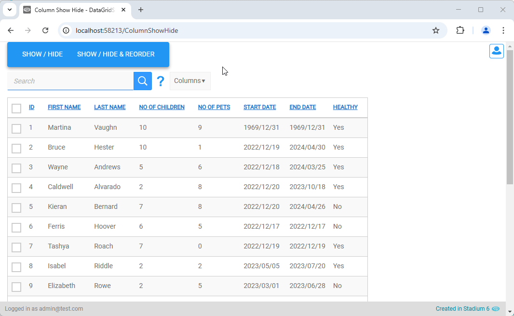
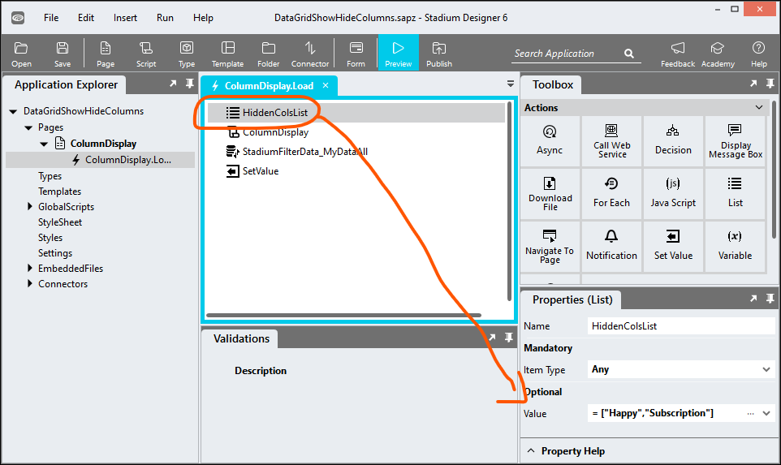
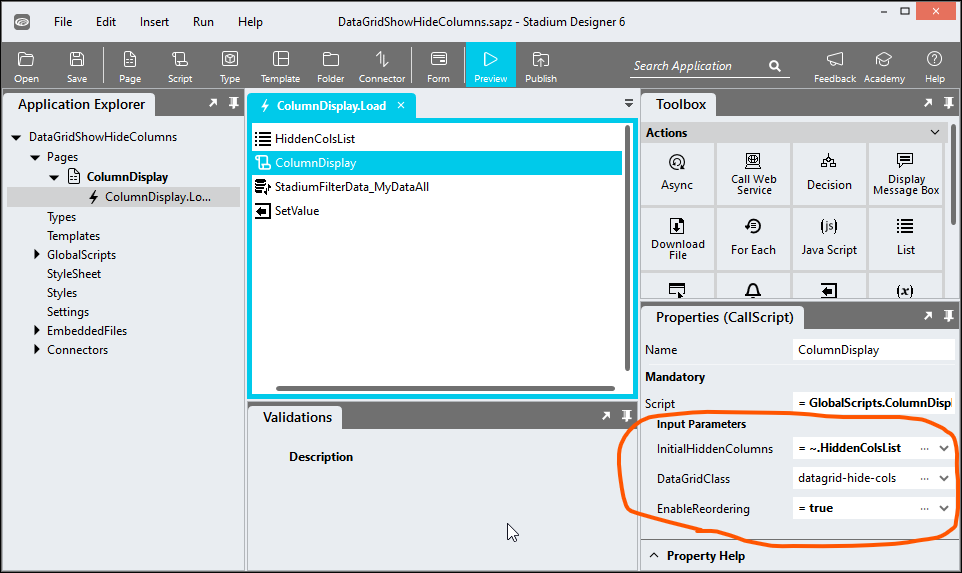

# DataGrid Show / Hide Columns

A repo to enable users to show/hide and o reorder columns in dataGrids.  



# Version 
1.1 Added logic to detect uniqueness of DataGrid class on page

1.2 Fixed Selectable column & hidden column bugs

1.3 Added column reordering feature; JS optimisations; CSS updates; Various bug fixes

1.4 Using DataModel instead of DOM; switched initially hidden input list from column numbers to names; added EnableReordering boolean to switch reorder feature on/off; fixed minor display bugs

1.5 Added support for 'SelectableData' column; moved repo from px to rem

## Application Setup
1. Check the *Enable Style Sheet* checkbox in the application properties

## Database, Connector and DataGrid
1. Use the instructions from [this repo](https://github.com/stadium-software/samples-database) to setup the database and DataGrid for this sample

## Global Script Setup
1. Create a Global Script called "ColumnDisplay"
2. Add input parameters below to the Global Script
   1. DataGridClass
   2. InitialHiddenColumns
   3. EnableReordering
3. Drag a *JavaScript* action into the script
4. Add the Javascript below into the JavaScript code property
```javascript
/* Stadium Script Version 1.5 https://github.com/stadium-software/datagrid-showhide-columns */
let scope = this;
let inputClass = ~.Parameters.Input.DataGridClass;
let dgClassName = "." + inputClass;
let enableReorder = ~.Parameters.Input.EnableReordering;
let dg = document.querySelectorAll(dgClassName);
if (dg.length == 0) {
    console.error("No control with the class '" + inputClass + "' was found");
    return false;
} else if (dg.length > 1) {
    console.error("The class '" + inputClass + "' is assigned to multiple DataGrids. DataGrids using this script must have unique classnames");
    return false;
}
dg = dg[0];
let hasSelectableData = getDMValues(dg, "HasSelectableData");
let hiddenCols = [];
/*Hide columns as per cookie*/
let hideCols = ~.Parameters.Input.InitialHiddenColumns;
let hiddenColsCookie = dg.id + "-hidden-columns";
if (!Array.isArray(hideCols)) hideCols = [];
let cookieCols = getCookie(hiddenColsCookie);
if (cookieCols !== null && cookieCols !== "") {
    hideCols = cookieCols.split(",");
}
/*Reorder columns as per cookie*/
let orderCookie = dg.id + "-column-order";
if (enableReorder) {
    let arrColOrder = [];
    let cookieColOrder = getCookie(orderCookie);
    if (cookieColOrder !== null) {
        arrColOrder = cookieColOrder.split(",");
    }
    let arrColumnDefinitions = getDMValues(dg, "ColumnDefinitions");
    for (let i = 0; i < arrColOrder.length; i++) {
        arrColumnDefinitions = moveItem(arrColumnDefinitions,i,getColItemIndex(arrColOrder[i]));
    }
}
initHideColumns();

function initHideColumns(){
    createDropDown();
    dg.querySelector(".column-display-selector-header").addEventListener("click", function(e){
        e.target.closest(".column-display-selector-container").classList.toggle("expand");
    });
    for (let i=0;i < hideCols.length;i++) {
        changeColVisibility(dg.id + hideCols[i].toLowerCase(), false);
    }
    document.body.addEventListener("click", function(e){
        if (!e.target.closest(".column-display-selector-container")) {
            let allDD = document.querySelectorAll(".column-display-selector-container");
            for (let i=0;i<allDD.length;i++){
                allDD[i].classList.remove("expand");
            }
        }
    });
}

/*DropDown*/
function createDropDown() {
    let fragment = new DocumentFragment();
    let checkboxListContainer = document.createElement("div");
    checkboxListContainer.classList.add("column-display-selector-container");
    
    let dropDownHeader = document.createElement("div");
    dropDownHeader.classList.add("column-display-selector-header");
    let dropDownHeaderText = document.createElement("span");
    dropDownHeaderText.innerText = "Columns";
    dropDownHeader.appendChild(dropDownHeaderText);
    checkboxListContainer.appendChild(dropDownHeader);

    let checkboxContainerInner = document.createElement("div");
    checkboxContainerInner.classList.add("control-container", "check-box-list-container", "column-display-checkboxlist");

    if (hasSelectableData) {
        let selectCheckboxContainer = document.createElement("div");
        let selectCheckbox = createCheckBox({"headerText":"CheckBox Column", "name":"SelectableData", "visible":true}, 0, true);
        selectCheckboxContainer.appendChild(selectCheckbox);
        checkboxContainerInner.appendChild(selectCheckboxContainer);
    }
    let checkboxList = document.createElement("div");
    if (enableReorder) {
        checkboxList.classList.add("drag-sort-enable");
    }
    let arrCols = [...getDMValues(dg, "ColumnDefinitions")];
    for (let i = 0; i < arrCols.length; i++) {
        let checkboxContainer = createCheckBox(arrCols[i], i + 1, false);
        checkboxList.appendChild(checkboxContainer);
        checkboxContainerInner.appendChild(checkboxList);
    }
    checkboxListContainer.appendChild(checkboxContainerInner);

    let dgHead = dg.querySelector(".data-grid-header");
    fragment.appendChild(checkboxListContainer);
    dgHead.appendChild(fragment);

    if (enableReorder) (()=> {enableDragSort('drag-sort-enable');})();
}
function createCheckBox(itemInfo, count, selectColumn){
    let labelText = itemInfo.headerText;
    if (!labelText) labelText = itemInfo.name;
    let display = itemInfo.visible;
    let checkboxContainer = document.createElement("div");
    checkboxContainer.classList.add("checkbox");
    checkboxContainer.setAttribute("order", count);
    if (!display) checkboxContainer.style.display = "none";
    if (enableReorder) {
        let checkboxDrag = document.createElement("div");
        if (!selectColumn) {
            checkboxDrag.classList.add("dragger");
        }
        if (selectColumn) {
            checkboxDrag.classList.add("no-dragger");
        }
        checkboxContainer.appendChild(checkboxDrag);
    }
    let checkbox = document.createElement("input");
    checkbox.setAttribute("type", "checkbox");
    if (display) checkbox.checked = true;
    checkbox.setAttribute("value", itemInfo.name);
    let checkboxID = dg.id + itemInfo.name.toLowerCase();
    checkbox.setAttribute("id", checkboxID);
    checkbox.addEventListener("change", toggleColumnDisplay);
    let checkboxLabel = document.createElement("label");
    checkboxLabel.setAttribute("for", checkboxID);
    checkboxLabel.innerText = labelText;
    checkboxContainer.appendChild(checkbox);
    checkboxContainer.appendChild(checkboxLabel);

    return checkboxContainer;
}
function toggleColumnDisplay(e) {
    let el = e.target;
    if (el.checked) {
        changeColVisibility(el.id, true);
    } else {
        changeColVisibility(el.id, false);
    }
}
function changeColVisibility(boxID, visible) {
    let box = document.getElementById(boxID);
    if (box) box.checked = visible;
    let name = boxID.replace(dg.id, "").toLowerCase();
    let arrCols = getDMValues(dg, "ColumnDefinitions");
    for (let i = 0; i < arrCols.length; i++) {
        if (arrCols[i].name.toLowerCase() == name) {
            arrCols[i].visible = visible;
        }
    }
    if (name == "selectabledata") {
        setDMValues(dg, "HasSelectableData", visible);
    }
    if (!visible) {
        hiddenCols.push(name);
    } else {
        const index = hiddenCols.indexOf(name);
        if (index > -1) hiddenCols.splice(index, 1);
    }
    createCookie(hiddenColsCookie, hiddenCols, 30);
}
/*Reorder*/
function enableDragSort(listClass) {
    const sortableLists = dg.getElementsByClassName(listClass);
    Array.prototype.map.call(sortableLists, (list) => {enableDragList(list);});
}
function enableDragList(list) {
    Array.prototype.map.call(list.children, (item) => {enableDragItem(item);});
}
function enableDragItem(item) {
    item.setAttribute('draggable', true);
    item.ondrag = handleDrag;
    item.ondragend = handleDrop;
}
function handleDrag(item) {
    const selectedItem = item.target,
          list = selectedItem.parentNode,
          x = event.clientX,
          y = event.clientY;
    selectedItem.classList.add('drag-sort-active');
    let swapItem = document.elementFromPoint(x, y) === null ? selectedItem : document.elementFromPoint(x, y);
    if (list === swapItem.parentNode) {
        swapItem = swapItem !== selectedItem.nextSibling ? swapItem : swapItem.nextSibling;
        list.insertBefore(selectedItem, swapItem);
    }
}
function handleDrop(item) {
    let elmnt = item.target;
    elmnt.classList.remove('drag-sort-active');
    reorder(elmnt);
}
function reorder(el) {
    let colIndex = Array.prototype.indexOf.call(el.parentNode.children, el);
    let colName = el.querySelector('input').value;
    let arrColDefs = getDMValues(dg, "ColumnDefinitions");
    let prev = arrColDefs.findIndex(item => item.name === colName);
    arrColDefs = moveItem(arrColDefs, colIndex, prev);
    createCookie(orderCookie, arrColDefs.map(a => a.name), 30);
}
function moveItem(array, to, from) {
    const item = array[from];
    array.splice(from, 1);
    array.splice(to, 0, item);
    return array;
}
/*Cookies*/
function createCookie(name, value, days) {
    let expires = "";
    if (days) {
        let date = new Date();
        date.setTime(date.getTime() + days * 24 * 60 * 60 * 1000);
        expires = "; expires=" + date.toGMTString();
    }
    document.cookie = name + "=" + value + expires + "; path=/";
}
function getCookie(c_name) {
    if (document.cookie.length > 0) {
        let c_start = document.cookie.indexOf(c_name + "=");
        if (c_start != -1) {
            c_start = c_start + c_name.length + 1;
            let c_end = document.cookie.indexOf(";", c_start);
            if (c_end == -1) {
                c_end = document.cookie.length;
            }
            return document.cookie.substring(c_start, c_end);
        }
    }
    return null;
}
/*DataModel*/
function getObjectName(obj) {
    let objname = obj.id.replace("-container","");
    do {
        let arrNameParts = objname.split(/_(.*)/s);
        objname = arrNameParts[1];
    } while ((objname.match(/_/g) || []).length > 0 && !scope[`${objname}Classes`]);
    return objname;
}
function getDMValues(ob, property) {
    let obname = getObjectName(ob);
    return scope[`${obname}${property}`];
}
function setDMValues(ob, property, value) {
    let obname = getObjectName(ob);
    scope[`${obname}${property}`] = value;
}
function getColItemIndex(name) { 
    return getDMValues(dg, "ColumnDefinitions").findIndex(item => item.name === name);
}
```

## Page Setup
1. Drag a *DataGrid* control to the page ([see above](#database-connector-and-datagrid))
2. Add a class of your choosing to the *DataGrid* *Classes* property that uniquely identifies this DataGrid on this page (e.g datagrid-hide-cols)
3. Note: If multiple editable DataGrids are shown on one page, each DataGrid must have a unique classname

## Page.Load Event Setup
1. Populate your DataGrid with data ([see above](#database-connector-and-datagrid))
2. To initialise the DataGrid with hidden columns
   1. Drag a *List* action into the script (type: Any)
   2. Enter the column names you want to hide (as per the column properties shown in screenshot below)



List Value Example:
```json
= ["Healthy","Happy"]
```


3. Drag the *ColumnDisplay* script into the script and complete the input parameters
   1. DataGridClass: The unique class you assigned to the *DataGrid* (e.g datagrid-hide-cols)
   2. InitialHiddenColumns: Leave blank or select your *List* containing the initial hidden columns from the dropdown
   3. EnableReordering: boolean to indicate whether users will be allowed to reorder DataGrid columns



## Applying the CSS
The CSS below is required for the correct functioning of the module. Some elements can be [customised](#customising-css) using a variables CSS file. 

**Stadium 6.6 or higher**
1. Create a folder called "CSS" inside of your Embedded Files in your application
2. Drag the two CSS files from this repo [*column-display-selector-variables.css*](column-display-selector-variables.css) and [*column-display-selector.css*](column-display-selector.css) into that folder
3. Paste the link tags below into the *head* property of your application
```html
<link rel="stylesheet" href="{EmbeddedFiles}/CSS/column-display-selector.css">
<link rel="stylesheet" href="{EmbeddedFiles}/CSS/column-display-selector-variables.css">
``` 


**Versions lower than 6.6**
1. Copy the CSS from the two css files into the Stylesheet in your application

## Customising CSS
1. Open the CSS file called [*column-display-selector-variables.css*](column-display-selector-variables.css) from this repo
2. Adjust the variables in the *:root* element as you see fit
3. Overwrite the file in the CSS folder of your application with the customised file

## CSS Upgrading
To upgrade the CSS in this module, follow the [steps outlined in this repo](https://github.com/stadium-software/samples-upgrading)
